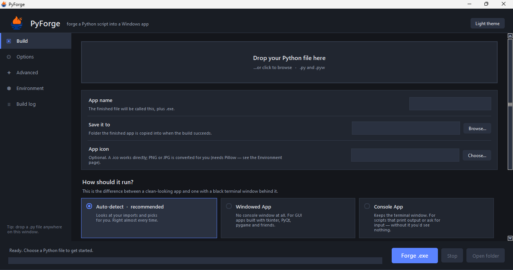

  

<h1 align="center">PyForge</h1>

  A friendly Windows application for converting Python scripts into
  portable executable files.

  <a href="../../releases/latest">
    <strong>Download the latest version</strong>
  </a>

  <strong>Licence:</strong> GNU GPL v3.0

A Windows app that forges a `.py` file into a `.exe`. Drop the file in, press
**Forge**. Every option is explained in plain English right next to it.

## Files

| File | What it is |
|---|---|
| `PyForge.exe` | The app, ready to run. Portable — copy it anywhere, no install. |
| `pyforge.py` | The source. Run with `python pyforge.py` if you prefer. |
| `assets/` | Logo and icon, bundled into the exe and used by the script. |
| `pyforge.png` | The original logo artwork. |

## Getting started

1. Double-click `PyForge.exe`.
2. Drag your `.py` file onto the window (or click the drop zone to browse).
   The app name, output folder and windowed/console guess all fill in for you.
3. Press **Forge .exe**.

A build takes 30–90 seconds. The **Build log** page shows exactly what
PyInstaller is doing, and the folder opens automatically when it's done.

---

## No black terminal window

This is the setting most people are after. On the **Build** page:

> **Hide the black terminal window**
> On: your app opens with no console behind it — what you want for anything
> with a window.
> Off: the terminal stays, which you need for scripts that print text or ask
> for input.

The switch and the three cards above it (*Auto-detect*, *Windowed App*,
*Console App*) are the same setting, so they always agree. Auto-detect reads
your imports and sets it for you; touching the switch commits to your choice.

---

## The pages

### Build

- **App name** — what the finished `.exe` is called.
- **Save it to** — where the finished app is copied.
- **App icon** — a `.ico` works directly. PNG and JPG are converted for you
  (needs Pillow, which the Environment page installs).
- **How should it run?** — Auto-detect / Windowed App / Console App, plus the
  terminal switch described above.
- **How should it be packaged?**
  - *Single file* — one portable `.exe`. Takes a few seconds longer to start,
    because it unpacks itself first.
  - *Folder* — the `.exe` plus its libraries. Starts instantly, but everything
    has to stay together.

### Options

- **Ask for administrator rights** — the app triggers the blue UAC prompt on
  launch. Only needed if your script writes to protected folders or the registry.
- **Splash screen** — shows an image immediately on launch, hiding the unpack
  delay of a single-file build.
- **Compress with UPX** — noticeably smaller `.exe`. Needs UPX installed, and
  some antivirus tools are wary of packed files.
- **Version details** — product name, company, version, description, copyright.
  These land on the Details tab of the file's properties in Windows.
- **Open the output folder when a build finishes**
- **Clear the build cache before each build**

### Advanced

- **Extra files** — PyInstaller only packs Python code it can see. Images,
  sounds, `.json` configs and data folders must be listed here or your app
  will crash looking for them. At runtime they land next to `sys._MEIPASS`.
- **Also include these modules** — fixes `No module named …` errors that only
  appear in the built `.exe`.
- **Leave these modules out** — drops unused packages to shrink the result.
- **Extra PyInstaller flags** — passed straight through.
- **Verbose debug build** — makes the finished `.exe` narrate its own startup.
  Useful when something works as a script but not as an `.exe`. Turn it off for
  the copy you share.
- **Command preview** — the exact command that will run, updating live.

### Environment

Checked automatically on every launch, in the background.

| | |
|---|---|
| Python | Required — the interpreter bundled into your `.exe` |
| pip | Required — installs the build tools |
| PyInstaller | Required — does the conversion |
| Pillow | Optional — lets you use PNG/JPG icons |
| UPX | Optional — shrinks the finished `.exe` |
| Drag & drop | Optional — built into this exe |

Anything missing gets an **Install** button, and **Install everything missing**
fixes them in one go. With *Fix missing pieces automatically* on (the default),
missing build tools are pip-installed at startup without asking, and PyInstaller
is kept up to date.

**Python itself is the one exception** — it's a system-wide install, so PyForge
always asks first, then uses winget. If winget isn't available it points you at
python.org.

You can also pick which Python to build with, if you have several. The version
you choose here is the version baked into your `.exe`.

### Build log

Full PyInstaller output, with **Save**, **Copy** and **Clear**. When a build
fails, the reason is in here.

---
## Screenshot

  

## One requirement worth knowing

PyForge itself needs nothing installed. **Building** an exe does need Python on
the PC, because PyInstaller works by copying a real interpreter and its standard
library into the exe it produces — there's nothing to copy without one. The
Environment page handles this for you.

## Notes

- Builds run in a temp folder, so no `build/`, `dist/` or `.spec` clutter is
  left next to your script.
- Your preferences (theme, output folder, toggles) are remembered in
  `%APPDATA%\PyForge\settings.json`.
- Antivirus sometimes flags fresh PyInstaller exes. It's a known false positive
  caused by the bootloader, not the app.
- The produced `.exe` is Windows-only, and 64-bit if your Python is.
